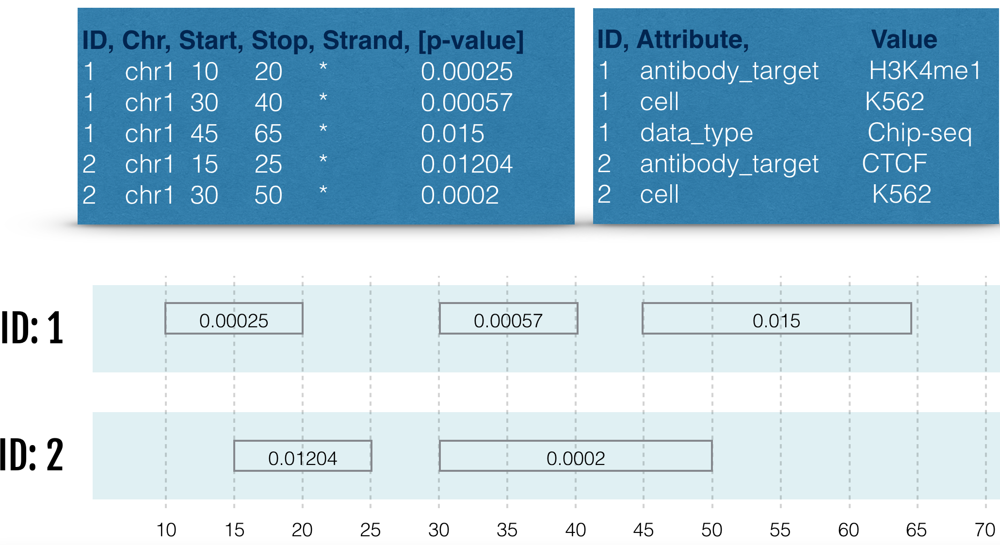

## Data set structure

A data set consists of a set of sample files, a set of meta files describing the samples, and a schema file.

GMQL data set is based on [Genomic Data Model (GDM)](http://www.sciencedirect.com/science/article/pii/S1046202316303012). In GDM, every sample file (for example: sample1.bed) should be associated with a meta file with the same name (sample1.bed.meta), as shown in the figure bellow. 

The sample file contains regions information, a region is an interval that is described by a chromosome number, start position, end position, strand, and a set of optional values that describe the region (such as score, p-value, or q-value). 

The samples of the same dataset should confirm to a common schema for the attributes, this schema is either a well known schema (can be seleted from a list of well known schemas, such as [BED](https://genome.ucsc.edu/FAQ/FAQformat#format1), Narrow peaks, or Broad Peaks formats) or uploaded with the dataset. For example, the schema file for the example bellow is described in an XML file as follows:

```
	<?xml version="1.0" encoding="UTF-8" standalone="yes"?>
	<gmqlSchemaCollection name="GLOBAL_SCHEMAS" xmlns="http://www.bioinformatics.deib.polimi.it/GMQL/">
		<gmqlSchema name="TAB_DELIMITED_EXAMPLE" type="TAB">
			<field type="STRING">chr</field>
			<field type="LONG">start</field>
			<field type="LONG">stop</field>
			<field type="CHAR">strand</field>
			<field type="DOUBLE">p-value</field>
		</gmqlSchema>
	</gmqlSchemaCollection>
```

Different datasets have different schemas, GMQL engine will take care of the heterogeneity of the datasets while performing GMQL operations.

The meta file contains attribute values separated by a tab. In the below example, we show two samples ( ID:1 and  ID:2 ). 


